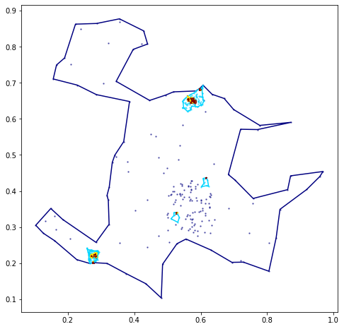

# Hierarchical Geo Clustering 


## Install

`pip install your_project_name`

## How to use

### Build a TreeCluster

We can build a hierarchical geographical cluster, the `TreeCluster` class allows to create te structure and then populate it.

```python
HGC = TreeClusters(3, random_seed= 12)
```

```python
HGC.populate_tree(number_per_cluster=100)
```

```python
HGC.print_structure()
```

    Root
    Root    
    ├── Root_l_0_n_0
    │   ├── Root_l_0_n_0_l_1_n_0
    │   │   ├── Root_l_0_n_0_l_1_n_0_l_2_n_0
    │   │   ├── Root_l_0_n_0_l_1_n_0_l_2_n_1
    │   │   ├── Root_l_0_n_0_l_1_n_0_l_2_n_2
    │   │   ├── Root_l_0_n_0_l_1_n_0_l_2_n_3
    │   │   └── Root_l_0_n_0_l_1_n_0_l_2_n_4
    │   └── Root_l_0_n_0_l_1_n_1
    │       ├── Root_l_0_n_0_l_1_n_1_l_2_n_0
    │       └── Root_l_0_n_0_l_1_n_1_l_2_n_1
    ├── Root_l_0_n_1
    │   ├── Root_l_0_n_1_l_1_n_0
    │   │   └── Root_l_0_n_1_l_1_n_0_l_2_n_0
    │   ├── Root_l_0_n_1_l_1_n_1
    │   │   ├── Root_l_0_n_1_l_1_n_1_l_2_n_0
    │   │   ├── Root_l_0_n_1_l_1_n_1_l_2_n_1
    │   │   └── Root_l_0_n_1_l_1_n_1_l_2_n_2
    │   ├── Root_l_0_n_1_l_1_n_2
    │   ├── Root_l_0_n_1_l_1_n_3
    │   │   ├── Root_l_0_n_1_l_1_n_3_l_2_n_0
    │   │   └── Root_l_0_n_1_l_1_n_3_l_2_n_1
    │   └── Root_l_0_n_1_l_1_n_4
    │       ├── Root_l_0_n_1_l_1_n_4_l_2_n_0
    │       ├── Root_l_0_n_1_l_1_n_4_l_2_n_1
    │       └── Root_l_0_n_1_l_1_n_4_l_2_n_2
    └── Root_l_0_n_2
        ├── Root_l_0_n_2_l_1_n_0
        │   ├── Root_l_0_n_2_l_1_n_0_l_2_n_0
        │   └── Root_l_0_n_2_l_1_n_0_l_2_n_1
        ├── Root_l_0_n_2_l_1_n_1
        │   ├── Root_l_0_n_2_l_1_n_1_l_2_n_0
        │   ├── Root_l_0_n_2_l_1_n_1_l_2_n_1
        │   ├── Root_l_0_n_2_l_1_n_1_l_2_n_2
        │   ├── Root_l_0_n_2_l_1_n_1_l_2_n_3
        │   └── Root_l_0_n_2_l_1_n_1_l_2_n_4
        ├── Root_l_0_n_2_l_1_n_2
        │   ├── Root_l_0_n_2_l_1_n_2_l_2_n_0
        │   ├── Root_l_0_n_2_l_1_n_2_l_2_n_1
        │   └── Root_l_0_n_2_l_1_n_2_l_2_n_2
        └── Root_l_0_n_2_l_1_n_3
            ├── Root_l_0_n_2_l_1_n_3_l_2_n_0
            ├── Root_l_0_n_2_l_1_n_3_l_2_n_1
            ├── Root_l_0_n_2_l_1_n_3_l_2_n_2
            ├── Root_l_0_n_2_l_1_n_3_l_2_n_3
            └── Root_l_0_n_2_l_1_n_3_l_2_n_4


```python
fig, axs = plt.subplots( figsize=(8,8))
HGC.visualize(axs, polygon=True)
```


```python
HGC.root.polygon_cluster
```


```python
HGC.get_deepth()
```


    4


### Extract the points and clusterize
To clusterize we extract the points and use the clusterize tool implemented in the `Clustering` module

```python
original_points= HGC.get_points_tree()
X_2=np.array([[p.x,p.y] for p in original_points])
dic_points={'points':[X_2], 'parent':''}
```

```python
HGC_adapta_DBSCAN = recursive_clustering_tree(dic_points,
                                       levels_clustering = 3,
                                       algorithm = 'adaptive_DBSCAN'
                                      )
```

```python
fig, axs = plt.subplots( figsize=(8,8))
HGC_adapta_DBSCAN.visualize(axs, polygon=True)
```





### Get the Similarity Form Measurement

To obtain the SMF the trees has to be use 

```python
form_metric=[]

for l in range(0, 4):
    d = { 'Level': l,                              
        'adaptive DBSCAN':similarity_clusterings(HGC.levels_nodes[l],
                            HGC_adapta_DBSCAN.levels_nodes[l])
        }
    form_metric.append(d)
```

```python
form_metric
```


    [{'Level': 0, 'adaptive DBSCAN': 0.8072675637368917},
     {'Level': 1, 'adaptive DBSCAN': 0.49739315930558003},
     {'Level': 2, 'adaptive DBSCAN': 0.463981718186057},
     {'Level': 3, 'adaptive DBSCAN': 0.20288774565650466}]


```python
df_metric_form = pd.DataFrame(form_metric)
```

```python
df_metric_form
```


<div>
<style scoped>
    .dataframe tbody tr th:only-of-type {
        vertical-align: middle;
    }

    .dataframe tbody tr th {
        vertical-align: top;
    }

    .dataframe thead th {
        text-align: right;
    }
</style>
<table border="1" class="dataframe">
  <thead>
    <tr style="text-align: right;">
      <th></th>
      <th>Level</th>
      <th>adaptive DBSCAN</th>
    </tr>
  </thead>
  <tbody>
    <tr>
      <th>0</th>
      <td>0</td>
      <td>0.807268</td>
    </tr>
    <tr>
      <th>1</th>
      <td>1</td>
      <td>0.497393</td>
    </tr>
    <tr>
      <th>2</th>
      <td>2</td>
      <td>0.463982</td>
    </tr>
    <tr>
      <th>3</th>
      <td>3</td>
      <td>0.202888</td>
    </tr>
  </tbody>
</table>
</div>


