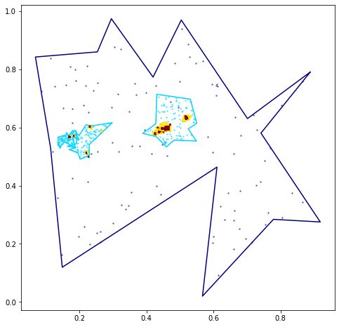

# Hierarchical Geo Clustering 


This file will become your README and also the index of your documentation.

## Install

`pip install your_project_name`

## How to use

We can build a hierarchical geographical cluster, the `TreeCluster` class allows to create te structure and then populate it.

```python
HGC = TreeClusters(3, random_seed= 12)
```

```python
HGC.populate_tree(number_per_cluster=100)
```

```python
HGC.print_structure()
```

    Root
    Root    
    ├── Root_l_0_n_0
    │   ├── Root_l_0_n_0_l_1_n_0
    │   │   ├── Root_l_0_n_0_l_1_n_0_l_2_n_0
    │   │   ├── Root_l_0_n_0_l_1_n_0_l_2_n_1
    │   │   ├── Root_l_0_n_0_l_1_n_0_l_2_n_2
    │   │   ├── Root_l_0_n_0_l_1_n_0_l_2_n_3
    │   │   └── Root_l_0_n_0_l_1_n_0_l_2_n_4
    │   └── Root_l_0_n_0_l_1_n_1
    │       ├── Root_l_0_n_0_l_1_n_1_l_2_n_0
    │       └── Root_l_0_n_0_l_1_n_1_l_2_n_1
    ├── Root_l_0_n_1
    │   ├── Root_l_0_n_1_l_1_n_0
    │   │   └── Root_l_0_n_1_l_1_n_0_l_2_n_0
    │   ├── Root_l_0_n_1_l_1_n_1
    │   │   ├── Root_l_0_n_1_l_1_n_1_l_2_n_0
    │   │   ├── Root_l_0_n_1_l_1_n_1_l_2_n_1
    │   │   └── Root_l_0_n_1_l_1_n_1_l_2_n_2
    │   ├── Root_l_0_n_1_l_1_n_2
    │   ├── Root_l_0_n_1_l_1_n_3
    │   │   ├── Root_l_0_n_1_l_1_n_3_l_2_n_0
    │   │   └── Root_l_0_n_1_l_1_n_3_l_2_n_1
    │   └── Root_l_0_n_1_l_1_n_4
    │       ├── Root_l_0_n_1_l_1_n_4_l_2_n_0
    │       ├── Root_l_0_n_1_l_1_n_4_l_2_n_1
    │       └── Root_l_0_n_1_l_1_n_4_l_2_n_2
    └── Root_l_0_n_2
        ├── Root_l_0_n_2_l_1_n_0
        │   ├── Root_l_0_n_2_l_1_n_0_l_2_n_0
        │   └── Root_l_0_n_2_l_1_n_0_l_2_n_1
        ├── Root_l_0_n_2_l_1_n_1
        │   ├── Root_l_0_n_2_l_1_n_1_l_2_n_0
        │   ├── Root_l_0_n_2_l_1_n_1_l_2_n_1
        │   ├── Root_l_0_n_2_l_1_n_1_l_2_n_2
        │   ├── Root_l_0_n_2_l_1_n_1_l_2_n_3
        │   └── Root_l_0_n_2_l_1_n_1_l_2_n_4
        ├── Root_l_0_n_2_l_1_n_2
        │   ├── Root_l_0_n_2_l_1_n_2_l_2_n_0
        │   ├── Root_l_0_n_2_l_1_n_2_l_2_n_1
        │   └── Root_l_0_n_2_l_1_n_2_l_2_n_2
        └── Root_l_0_n_2_l_1_n_3
            ├── Root_l_0_n_2_l_1_n_3_l_2_n_0
            ├── Root_l_0_n_2_l_1_n_3_l_2_n_1
            ├── Root_l_0_n_2_l_1_n_3_l_2_n_2
            ├── Root_l_0_n_2_l_1_n_3_l_2_n_3
            └── Root_l_0_n_2_l_1_n_3_l_2_n_4


```python
fig, axs = plt.subplots( figsize=(8,8))
HGC.visualize(axs, polygon=True)
```





```python
HGC.root.polygon_cluster
```


```python
HGC.get_deepth()
```


    4


To clusterize we extract the points and use the clusterize tool implemented in the `Clustering` module

```python
original_points= HGC.get_points_tree()
X_2=np.array([[p.x,p.y] for p in original_points])
dic_points={'points':[X_2], 'parent':''}
```

```python
HGC_adapta_DBSCAN = recursive_clustering_tree(dic_points,
                                       levels_clustering = 3,
                                       algorithm = 'adaptive_DBSCAN'
                                      )
```
